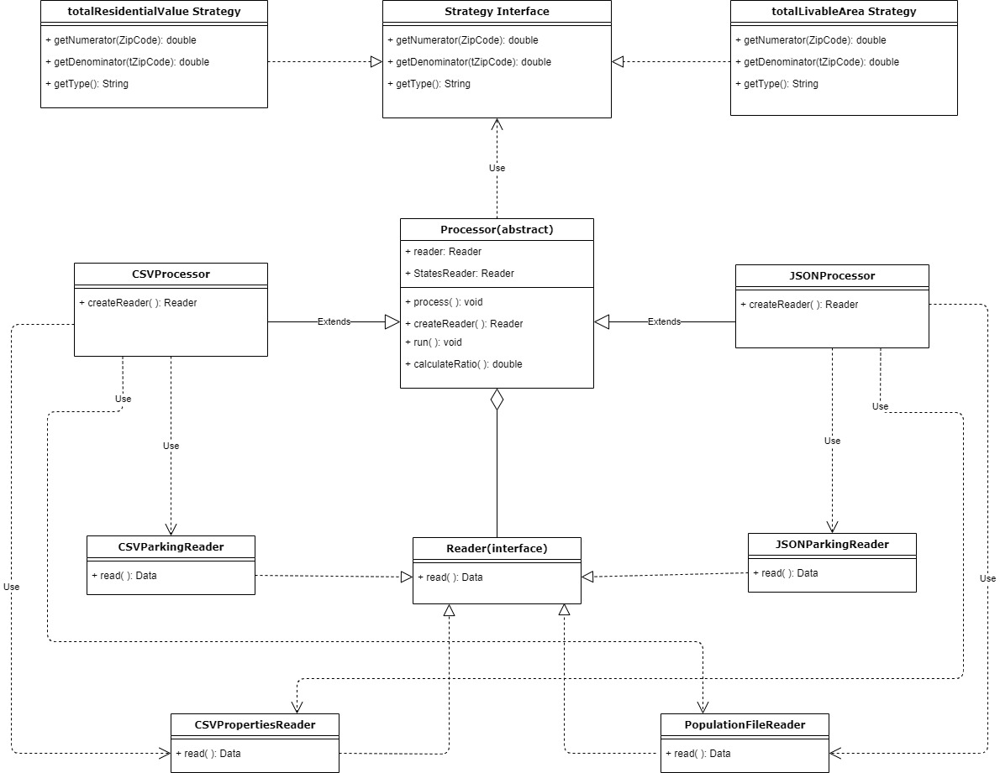
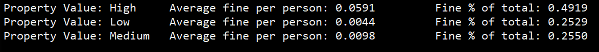
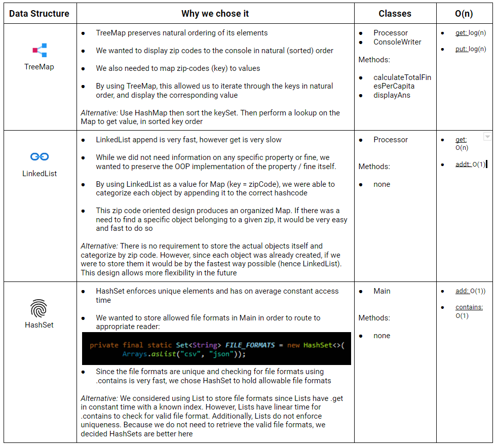

*Authors*: Jorge Camilio Wu Zhang, Kelvin Cheung

**Overview:**\
The OpenDataPhilly portal makes over 300 data sets, applications and
APIs related to the city of Philadelphia available for free to
government officials, researchers, academics, and the general public so
that they can analyze and get an understanding of what is happening in
this vibrant city.

In this project, we worked with several types of data from https://www.opendataphilly.org/ 
and data formats in order to conduct data analysis and specifically hone our software design skills. Highlights include:

  - > Implementing the strategy method to reduce code duplication

  - > Implementing singleton classes to control for a single class
    > instance

  - > Organize classes according to N-tier Architecture

  - > Applying a wide range of data structures

The software design choices and implementation is shown below as a UML diagram:

**Additional Feature:**

In addition to computing average residential market value, total fines
per capita, etc … We were especially interested in computing the
average parking ticket fine per person for
different categories of property value by implementing the
following:

Categorize all the zipcode's total residential market value into low,
mid, and high tiers:

1.  > low range: less than or equal to
    > 250k

2.  > mid range: between 250k and 600k

3.  > high range: greater than 600k

For each category we calculated the ratio between fines committed over
its category total population and also the percentage of that total fine
amount over the three categories. What we found was quite interesting
and perhaps worth looking into:

The calculation uses data from the following data sets \[fields\]:

  - > Zip Code \[population\]

  - > Properties \[Property Value\]

  - > Parking Fines \[Ticket Amount\]

Firstly, we found the average property value for each zip code and
grouped them into low, medium or high based on market consensus for
these price ranges in Philadelphia. We then divided each category’s
total parking fines count by the total population of the zip codes
belonging to that category. The result is akin to “are richer
neighborhoods fined more often than poorer neighborhoods”

**Use of Data Structures:**

Our OpenDataPhilly project uses several types of data structures. While
we’ve overloaded many methods to accept different argument param types,
we paid special attention to certain ones for efficiency’s sake.

Here are some data structures we paid special attention to and why we
chose them:

