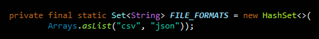

# **OpenDataPhilly :** **Project Report**

*Authors*: Jorge Camilio Wu Zhang, Kelvin Cheung

The OpenDataPhilly portal makes over 300 data sets, applications and
APIs related to the city of Philadelphia available for free to
government officials, researchers, academics, and the general public so
that they can analyze and get an understanding of what is happening in
this vibrant city.

In this project, we worked with several types of data and data formats
in order to conduct data analysis and specifically hone our software
design skills. Highlights include:

  - > Implementing the strategy method to reduce code duplication

  - > Implementing singleton classes to control for a single class
    > instance

  - > Organize classes according to N-tier Architecture

  - > Applying a wide range of data structures

**Additional Feature**

In addition to computing average residential market value, total fines
per capita, etc … We were especially interested in computing the
average parking ticket fine per person for
different categories of property value by implementing the
following:

Categorize all the zipcode's total residential market value into low,
mid, and high tiers:

1.  > low range: less than or equal to
    > 250k

2.  > mid range: between 250k and 600k

3.  > high range: greater than 600k

For each category we calculated the ratio between fines committed over
its category total population and also the percentage of that total fine
amount over the three categories. What we found was quite interesting
and perhaps worth looking into:

The calculation uses data from the following data sets \[fields\]:

  - > Zip Code \[population\]

  - > Properties \[Property Value\]

  - > Parking Fines \[Ticket Amount\]

Firstly, we found the average property value for each zip code and
grouped them into low, medium or high based on market consensus for
these price ranges in Philadelphia. We then divided each category’s
total parking fines count by the total population of the zip codes
belonging to that category. The result is akin to “are richer
neighborhoods fined more often than poorer neighborhoods”

**Use of Data Structures**

Our OpenDataPhilly project uses several types of data structures. While
we’ve overloaded many methods to accept different argument param types,
we paid special attention to certain ones for efficiency’s sake.

Here are some data structures we paid special attention to and why we
chose them:

<table>
<thead>
<tr class="header">
<th><strong>Data Structure</strong></th>
<th><strong>Why we chose it</strong></th>
<th><strong>Classes</strong></th>
<th><strong>O(n)</strong></th>
</tr>
</thead>
<tbody>
<tr class="odd">
<!-- <td>

 -->

TreeMap
</td>
<td><ul>
<li>
TreeMap preserves natural ordering of its elements
</li>
<li>
We wanted to display zip codes to the console in natural (sorted) order
</li>
<li>
We also needed to map zip-codes (key) to values
</li>
<li>
By using TreeMap, this allowed us to iterate through the keys in natural order, and display the corresponding value
</li>
</ul>

<em>Alternative:</em> Use HashMap then sort the keySet. Then perform a lookup on the Map to get value, in sorted key order
</td>
<td><ul>
<li>
Processor
</li>
<li>
ConsoleWriter
</li>
</ul>

Methods:

<ul>
<li><blockquote>

calculateTotalFinesPerCapita

</blockquote></li>
<li><blockquote>

displayAns

</blockquote></li>
</ul></td>
<td><ul>
<li>
get: log(n)
</li>
<li>
put: log(n)
</li>
</ul></td>
</tr>
<tr class="even">
<!-- <td>

 -->

LinkedList
</td>
<td><ul>
<li><blockquote>

LinkedList append is very fast, however get is very slow

</blockquote></li>
<li><blockquote>

While we did not need information on any specific property or fine, we wanted to preserve the OOP implementation of the property / fine itself.

</blockquote></li>
<li><blockquote>

By using LinkedList as a value for Map (key = zipCode), we were able to categorize each object by appending it to the correct hashcode

</blockquote></li>
<li><blockquote>

This zip code oriented design produces an organized Map. If there was a need to find a specific object belonging to a given zip, it would be very easy and fast to do so

</blockquote></li>
</ul>

<em>Alternative:</em> There is no requirement to store the actual objects itself and categorize by zip code. However, since each object was already created, if we were to store them it would be by the fastest way possible (hence LinkedList). This design allows more flexibility in the future
</td>
<td><ul>
<li>
Processor
</li>
</ul>

Methods:

<ul>
<li>
none
</li>
</ul></td>
<td><ul>
<li>
get:
</li>
</ul>

O(n)

<ul>
<li>
addt: O(1)
</li>
</ul></td>
</tr>
<tr class="odd">
<!-- <td>

 -->

HashSet
</td>
<td><ul>
<li><blockquote>

HashSet enforces unique elements and has on average constant access time

</blockquote></li>
<li><blockquote>

We wanted to store allowed file formats in Main in order to route to appropriate reader:

</blockquote></li>
</ul>

<ul>
<li><blockquote>

Since the file formats are unique and checking for file formats using .contains is very fast, we chose HashSet to hold allowable file formats

</blockquote></li>
</ul>

<em>Alternative:</em> We considered using List to store file formats since Lists have .get in constant time with a known index. However, Lists have linear time for .contains to check for valid file format. Additionally, Lists do not enforce uniqueness. Because we do not need to retrieve the valid file formats, we decided HashSets are better here
</td>
<td><ul>
<li>
Main
</li>
</ul>

Methods:

<ul>
<li>
none
</li>
</ul></td>
<td><ul>
<li>
add: O(1))
</li>
<li>
contains: O(1)
</li>
</ul></td>
</tr>
</tbody>
</table>
